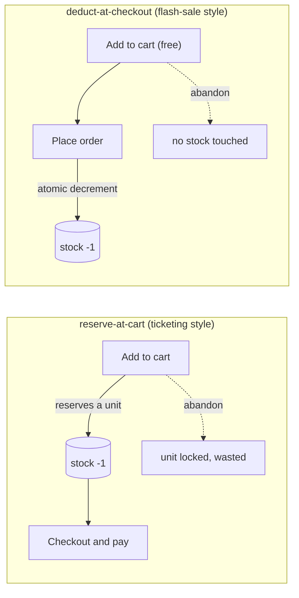
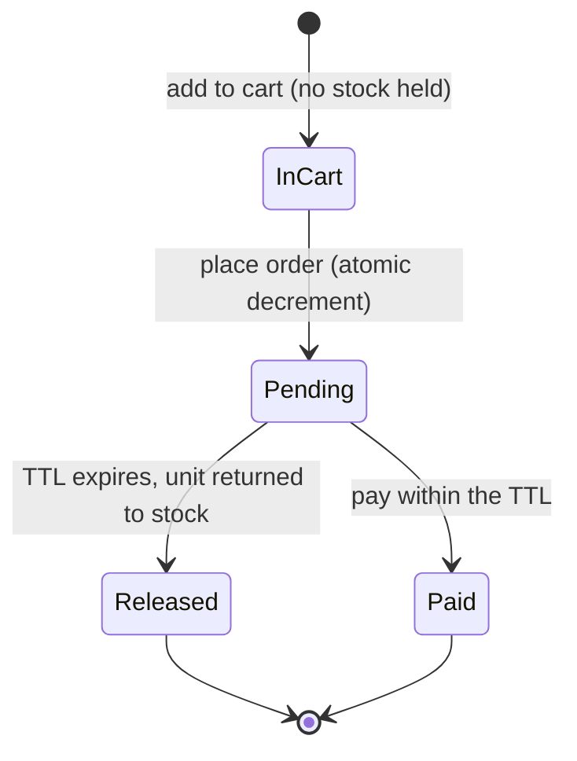

# E-commerce Flash Sale — Everyone Adds to Cart, Few Check Out

A runnable lab for the flash-sale sibling of ticket selling: 100,000 shoppers, 100 units,
and the deliberate design where **add-to-cart succeeds for everyone but stock is only
decremented at order placement**. It measures *why* that beats reserving stock in the cart,
how a payment TTL reclaims stock from non-payers, and how a per-user cap stops scalpers —
each shown with the working fix, not just the failure.

Pure standard library — no services, no dependencies. Deterministic models, so the tables
below reproduce exactly.

> Part of my [Solution Architect labs](https://longpham.tech). Companion write-up: [Everyone Adds to Cart, Few Check Out](https://longpham.tech/blog/ecommerce-flash-sale).
>
> Sibling lab (spike + oversell mechanics in Laravel): [`high-demand-ticketing`](https://github.com/viplct/high-demand-ticketing).

---

## Why this matters (the Solution Architect angle)

A flash sale is the same contended-finite-inventory problem as ticketing — but the winning
design is the opposite of a seat map. A seat is reserved the moment it's in your cart; a
flash-sale item is **not**, because most carts are abandoned and reserving stock for
abandoners would starve real buyers. So the correct pattern is: **oversubscribe the cart,
decrement only at checkout, put a TTL on the pending order, and cap purchases per user.**
This lab quantifies each of those decisions.

## Quick start

Requires only Python 3.10+.

```bash
make funnel    # reserve-at-cart vs deduct-at-checkout as abandonment rises
make timeout   # pending-order payment TTL reclaims stock from non-payers
make limit     # per-user cap stops scalpers hoarding the drop
make sybil     # why a per-user cap alone fails, and defense in depth
```

## The two ways to hold inventory



## 1. Deduct at checkout, not in the cart (`make funnel`)

400 shoppers, 100 units, as the cart-abandonment rate rises:

```
   abandon  strategy             add-to-cart   sold   wasted  buyers lost
  -----------------------------------------------------------------------
      20%  reserve-at-cart              25%     80       20          240
            deduct-at-checkout          100%    100        0          220
      40%  reserve-at-cart              25%     60       40          180
            deduct-at-checkout          100%    100        0          140
      60%  reserve-at-cart              25%     40       60          120
            deduct-at-checkout          100%    100        0           60
```

**reserve-at-cart** decrements when you add to cart, so abandoners lock stock they never buy
(`wasted`), and real buyers are turned away because the cart "sold out" to holds — only 25%
even get an item into the cart, and at 40% abandonment it sells just **60** of 100 units.

**deduct-at-checkout** touches no stock until the order is placed, so **100% of shoppers add
to cart** and no unit is ever spent on an abandoner — it sells the **full 100** at every
abandonment rate. That is why "everyone can add to cart, few check out" is the *correct*
design, not a bug.

## 2. Pending orders need a payment TTL (`make timeout`)

Deducting at checkout leaves a smaller gap: a buyer places the order (stock −1, order =
pending) then never pays. Without a timeout that unit is stranded. A TTL cancels the unpaid
order and returns the unit to waiting demand:

```
   non-payment    no timeout: sold    with timeout: sold
  ------------------------------------------------------
          10%             90 ( 90%)            100 (100%)
          30%             70 ( 70%)            100 (100%)
          50%             50 ( 50%)            100 (100%)
```

At 30% non-payment you sell only 70% of stock without a TTL; the timeout drives utilization
back to **~100%**. It's the seat-hold/reaper pattern from the ticketing lab, moved to the
**order** level — same idea, later stage.



## 3. A per-user cap stops scalpers (`make limit`)

100 units, 200 genuine buyers (one request each) plus 20 scalpers firing 50 requests each:

```
  policy                  to scalpers   unique buyers   most by one
  ---------------------------------------------------------------
  no limit                      83 (83%)              36           8.1
  per-user limit = 1            20 (20%)             100           1.0
```

With no cap, stock goes to whoever sends the most requests — 20 scalpers scoop **83%** and
only ~36 people are served. A **one-per-account cap** drops the scalper share to **20%** and
spreads the drop across all **100 unique buyers**. But a cap on *accounts* is only as strong
as account identity — which is where the next test comes in.

## 4. A cap on users isn't a cap on bots — defense in depth (`make sybil`)

A per-account cap assumes one person = one account. A bot creates thousands of free fake
accounts (a **Sybil attack**), so the cap barely dents it. No single control wins; you stack
layers that each spend a *different scarce resource* the bot must have. Scalper share of 100
units as each layer is added (bot: unlimited fake accounts, 15 real cards, 85% datacenter IPs):

```
  defense (cumulative)        to scalpers  to genuine  real buyers blocked
  ------------------------------------------------------------------------
  no defense                       94 (94%)           6                    0
  + per-user cap                   94 (94%)           6                    0
  + datacenter/ASN block           69 (69%)          31                    0
  + payment/card cap               15 (15%)          85                    0
  + account-age gate                0 ( 0%)         100                   25
```

- **per-user cap alone ≈ no defense** — fake accounts are free, so 94% still goes to the bot.
- **datacenter/ASN block** — real buyers aren't on cloud/proxy IPs; cuts most bot traffic (94→69%).
- **payment/card cap** (one purchase per card) — real cards are expensive, so this pins the bot
  to its ~15 cards (69→15%). The cheapest decisive layer.
- **account-age gate** — Sybil accounts are brand new, so blocking new accounts stops them cold
  (→0%) — **but it also locks out 25 real first-time buyers**. A trade-off, not a free win.

The lesson: **anchor on resources bots can't cheaply mass-produce** (cards, phone numbers,
aged accounts, non-datacenter IPs), stack the layers, and accept that each has a cost or a
gap. It's an economics game — raise the attacker's cost above their expected profit.

## What carries over from ticketing (not re-measured here)

The mechanics the checkout itself relies on are proven in the [`high-demand-ticketing`](https://github.com/viplct/high-demand-ticketing) lab and apply unchanged:

- **Atomic decrement** at checkout (`UPDATE ... SET stock = stock - :n WHERE stock >= :n`)
  so a burst of concurrent orders never oversells; buying N units is one all-or-nothing update.
- **Idempotent payment** on a client key (retries + webhooks → one order, one charge).
- A **virtual waiting room** in front when the spike is large enough to crush the backend.
- Per-SKU (and per-warehouse) counters, i.e. the sharded hot-key model.

**One real difference in risk appetite:** ticketing must never oversell; e-commerce often
tolerates a small deliberate oversell (backorder / refund) to maximize conversion — a product
decision, not a correctness one.

## What's inside

```
sim/cart_vs_checkout.py       reserve-at-cart vs deduct-at-checkout funnel
sim/pending_order_timeout.py  payment TTL reclaims stock from non-payers
sim/per_user_limit.py         per-user cap vs scalper hoarding
sim/sybil_defense.py          layered anti-bot defense vs a Sybil (fake-account) attack
docs/architecture.md          walkthrough
docs/adr/                     decision records
```

## Design decisions

- [ADR-0001 — Oversubscribe the cart, decrement at checkout](docs/adr/0001-deduct-at-checkout.md)
- [ADR-0002 — Pending-order TTL and a per-user purchase cap](docs/adr/0002-timeout-and-per-user-cap.md)

## Honest caveats

- These are **deterministic models** (funnel/limit average many seeded trials; the timeout is
  an expected-value model). They isolate the mechanism and its shape — the *reason*
  deduct-at-checkout wins, not a production benchmark of a specific store.
- Real stores blend the two (soft-reserve popular SKUs briefly, hard-decrement at order) and
  add fraud scoring, address checks, and inventory across warehouses — out of scope here.

## License

MIT — it's a learning lab, take anything useful.
